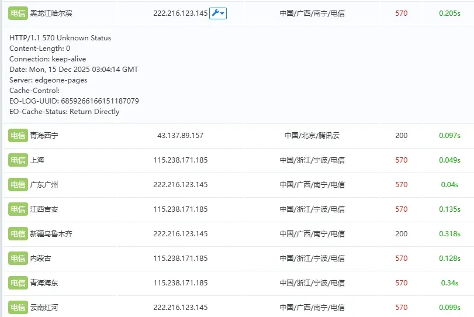

# 正式开始

正常来说，DDOS应该是针对单个IP的，因为正常来说，运营一个网站，肯定是需要买一台服务器，然后再在其上跑服务，最终一切准备就绪开放到公网中

如果说没有高防，并且没有CDN，市面上很多的免费DDOS就可以轻松将一个IP打死

但是，该网站情况非常不同，它是一个 **由CDN直接应答的静态网站** 

也就是说，**攻击该网站 = 攻击CDN** 

按往常来说，这几乎是不可能的

从宏观角度来思考，CDN是用来清洗流量的，清洗恶意流量，然后放行干净流量访问源站

但是如果是一个静态网站呢？

它根本就没有源站，每一个请求都被视为有效请求被CDN所应答

并且CDN本来就是 **清洗流量** 的第一道防线，也是最有效的一道防线

所以综上，如果有人打CDN，绝对是自讨苦吃，我也根本不需要管

但，真的是这样吗？

如果说攻击者的目的不是 **打死CDN** 呢？

那么事情就变得有趣起来了

最开始，我跟上面所讲的一样，根本就没有管任何攻击，无论是一天打了1T，还是连着打了几天，我都没有管

因为那个时候网站仍然可以被正常访问，只是控制台看到的流量很高，但是并不影响正常用户访问，对吧，所以当然可以不用管

但是接下来事情有些异常了，某一天，我的朋友跟我说你的网站打开会报状态码 **570** 

于是我就发现在那个时候，攻击者开始加强了攻击力度，现在的力度已经可以做到拒绝普通访客访问了

这种力度很恐怖，于是我立马查看攻击源IP，发现大多都为印度尼西亚的IP，接着，我对国内侧的CDN做了 L7 层的海外屏蔽，并且配置了国内外分流，让正常海外流量也能通行

这种做法极大缓解了针对于印度尼西亚IP的攻击，一天拉的流量从几十T骤降为几T

事情看似圆满的解决了，但才刚刚开始

接着又过了一个月，新一轮的DDOS来了，这次攻击者使用了非常多的国内IP来进行攻击，并且由于我们没有也根本不可能对国内访客访问国内CDN一刀切死

我们可以顺便想想为什么攻击者有这么多的国内IP？真的是自己烧的钱吗？我们不妨看看大部分流量的UA（尽管它可以伪造）

可以看到大部分都为BT下载器，这可能和最近的 [React/NextJS - NVD - CVE-2025-55182](https://nvd.nist.gov/vuln/detail/CVE-2025-55182) 以及 [FnOS - 重要安全更新通知](https://mp.weixin.qq.com/s/LzkLcy92m5O24up_9c4NUA) 有关。攻击者可能从公网扫描了大批未及时修复漏洞的肉鸡发起的攻击

不过就算大概知道了攻击手法，也不知道防范方案，所以在这几天，我们几乎处于无计可施的状态，虽然上了速率限制，但是由于攻击源IP非常多，速率限制几乎是被触发后就切IP，最终依然可以做到一天拉流几十T

接着我又将国内CDN的 HTTP2 关闭，由于H2可以连接复用，而一旦不支持H2，攻击者就仅能通过H1或H1.1来刷流量，每一个HTTP连接都会占用一个原始的TCP连接，我认为这么做可以让攻击者单机拉流更困难，但是就如上文所说，攻击源IP非常多，这种做法似乎并不能牵制多久

网站被攻击的时候所有人都无法打开，但我确实也已经无计可施了

最后，攻击者不再执着仅攻击这个静态站点了，转而去攻击其他的API，比如Umami，随机图等等

不久后，EdgeOne就封掉了随机图的域名，我不得不去另寻他法来解决

当时我暂时通过换一个子域名去规避针对于域名的封禁，但是一旦改了API域名，所有用这个API的业务都需要同步更改，这耗费了我不少的精力

一想到等新一轮的攻击到来后，域名再次被攻击至封禁，接着再切域名，再改服务等等就很累

群u粉丝也是说到

确实也是这样，尽管国内用户直连国内CDN能得到及其优异的访问，但是一旦被打，就连访问都访问不上，更别说速度了

最终，又花了小半天时间将该网站本体以及其他API全部迁移到了Cloudflare，尽管攻击者仍在持续不断的攻击，但是还不至于打死Cloudflare

# 疑难解答
> 至此还有非常多的内容没说，但是他们没法串在一起，就用QA的形式回答吧

- **为什么只有你被打？为什么我的网站没被打？**
- 因为我是主播，被打了会有反应，很可爱

- **为什么要攻击一个静态网站？静态不是打不死吗？**
- 的确，打静态网站 = 打CDN，但由于使用国内CDN，如EO/ESA，众所周知，国内的带宽非常金贵，并且EO/ESA还是免费提供服务的，防护力度自然没有国际大厂Cloudflare强力。通过上文也可知，攻击者的确可以 **打死EO/ESA** ，使其在一段时间无法为你的网站提供服务。另一方面，如果我们不做任何防护措施，CDN平台就可能会认为我们在滥用资源，从而封禁/清退域名，使得我们后续实行补救措施更加困难

- **不是已经做了WAF（如海外屏蔽，速率限制等）吗？难道这些规则纯摆设吗？
- 要回答这个问题，我们首先需要知道WAF本来是防什么的。正常来说，一个网站应该是，源站脆弱，由CDN拦截大部分恶意请求，仅让正常请求流入源站。就好比你的源站有高清无码大片，你就可以写个速率限制，让单IP一秒只能请求一次，这样，恶意请求就拿不到你源站热情的高清无码大片，只能拿到CDN冰冷的拦截画面。但我们是静态，没有源站，或者说源站就是CDN。所有请求，有效或无效都是直接打到“源站”，也就是CDN上的，哪怕我们写了海外屏蔽，写了速率限制，这些也都是L7层的，攻击者仍然可以无限制的去在L4层建立TCP连接来促使CDN拒绝来自我们站点域名的服务。除非我们能够控制CDN的L4层WAF，并且设置严格的WAF规则，直接拒绝来自攻击者的TCP握手请求，才有可能逃脱最终被打死的宿命

- **为什么要切Cloudflare？不是说攻击者打的是CDN吗，Cloudflare就不会被打死吗？
- Cloudflare曾抵御过高达 22.2Tbps 的攻击，对于攻击我们的流量来说，完全是小菜一碟，详见： https://x.com/Cloudflare/status/1970244046946759024 ，[Cloudflare 2025年第三季度DDoS威胁报告——包括僵尸网络的顶尖攻击者Aisuru](https://blog.cloudflare.com/ddos-threat-report-2025-q3/?utm_source=chatgpt.com/)

- **我也有网站，我要如何避免如此恐怖的DDOS攻击？** 
- 不让攻击者觉得打你有价值，打你好玩，你就不会被打（？）

# 所有攻击报表
> 我们是最近刚切到Cloudflare的，在此之前我们使用的是EdgeOne/ESA

### Cloudflare

### ESA

